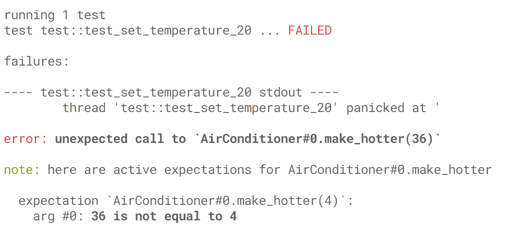

# Mockers

__Mockers__ is a mocking library (and compiler plugin) for Rust.

It is inspired by [Google Mock].

## Table of Contents

<!-- TOC depthFrom:2 depthTo:6 withLinks:1 updateOnSave:1 orderedList:0 -->

- [Table of Contents](#table-of-contents)
- [Getting Started](#getting-started)
	- [Nightly Rust](#nightly-rust)
	- [Stable Rust](#stable-rust)
	- ["Macros 1.1"](#macros-11)
- [Usage](#usage)
	- [Basics](#basics)
	- [Argument Matchers](#argument-matchers)
	- [Reactions](#reactions)
	- [Expecting no calls](#expecting-no-calls)
	- [Expecting several calls](#expecting-several-calls)
	- [Order of calls](#order-of-calls)
	- [Matching calls](#matching-calls)
	- [Checkpoints](#checkpoints)
	- [Usage from Test Crate](#usage-from-test-crate)
	- [Named mockers](#named-mockers)
	- [Creating mocks and expectations from within actions](#creating-mocks-and-expectations-from-within-actions)
	- [Mocks cloning](#mocks-cloning)
	- [Associated types](#associated-types)
	- [Trait type parameters](#trait-type-parameters)
	- [Inherited traits & mocking several traits](#inherited-traits-mocking-several-traits)
- [Mocking structures](#mocking-structures)
- [Error messages](#error-messages)
- [Debugging](#debugging)

<!-- /TOC -->

## Getting Started

### Nightly Rust

This is the simplest way to use `mockers` library.

Run

```sh
$ multirust override nightly
```

or

```sh
$ rustup override set nightly
```

if you use [rustup](http://rustup.rs/).

Next, add `mockers` and `mockers_macros` as dependencies to your `Cargo.toml`:

```toml
[dependencies]
mockers_macros = "0.9.0"

[dev-dependencies]
mockers = "0.9.0"
```

Now you are ready to start testing.

This approach is used by [air_macro](../examples/air_macro/) example.

### Stable Rust

You will have to use code generation on stable Rust. It means that types
you want to mock must live in a separate file which will be processed during build.

Add `mockers` and `mockers_macros` as dependencies to your `Cargo.toml`:

```toml
[build-dependencies.mockers_codegen]
version = "0.9.0"
features = ["with-syntex"]

[dev-dependencies.mockers]
version = "0.9.0"
default-features = false
```

Add build script and register it in your `Cargo.toml`:

```rust
// build.rs
extern crate mockers_codegen;

use std::env;
use std::path::Path;

fn main() {
    let out_dir = env::var_os("OUT_DIR").unwrap();

    let src = Path::new("src/types.in.rs");
    let dst = Path::new(&out_dir).join("types.rs");

    mockers_codegen::expand(&src, &dst).unwrap();
}
```

```toml
# Cargo.toml

[package]
…
build = "build.rs"
```

Now you are ready to start testing.

This approach is used by [air_codegen](../examples/air_codegen/) example.

### "Macros 1.1"

Rust now has ["macros 1.1"] feature which is intended to support
deriving custom user traits on stable Rust without code generation.

Unfortunately, this feature doesn't support `derive` clause on traits.
However, upcoming [procedural macros feature] supports arbitrary macro
attributes.

`mockers` is ready to use procedural macros feature right now, `air_proc_macro`
example shows how to do it.

Procedural macros will be used as a primary usage scenario after feature
stabilization.

## Usage

### Basics

Say we have an `air` crate with some trait and a function using this trait:

```rust
// src/lib.rs
#![crate_name = "air"]

pub trait AirConditioner {
    fn make_hotter(&mut self, by: i16);
    fn make_cooler(&mut self, by: i16);
    fn get_temperature(&self) -> i16;
}

pub fn set_temperature_20(cond: &mut AirConditioner) {
    let t = cond.get_temperature();
    if t < 20 {
        cond.make_hotter(20 + t);
    } else {
        cond.make_cooler(t - 20);
    }
}
```

On nightly, import the `mockers` crate and the `mockers_macros` compiler plugin:

```rust
// src/lib.rs

#![feature(plugin, custom_derive)]
#![plugin(mockers_macros)]

#[cfg(test)] extern crate mockers;

…
```

On stable, move trait definition the separate file (`src/types.in.rs`) and
import `mockers` crate:

```rust
// src/lib.rs

include!(concat!(env!("OUT_DIR"), "/types.rs"));
```

```rust
// src/types.in.rs

#[cfg(test)] extern crate mockers;

#[derive(Mock)]
pub trait AirConditioner {
    …
}
```

Ok, lets start testing:

```rust
// src/lib.rs

…

#[cfg(test)]
mod test {

    use super::*;
    use mockers::Scenario;

    #[test]
    fn test_set_temperature_20() {
        let scenario = Scenario::new();
        let mut cond = scenario.create_mock_for::<AirConditioner>();

        scenario.expect(cond.get_temperature_call().and_return(16));
        scenario.expect(cond.make_hotter_call(4).and_return(()));

        set_temperature_20(&mut cond);
    }

}
```

Run test:

```sh
Compiling air v0.1.0 (file:///Users/kriomant/Temp/air)
  Running target/debug/air-b2c5f8b6920cb30a

running 1 test
test test::test_set_temperature_20 ... FAILED

failures:

---- test::test_set_temperature_20 stdout ----
thread 'test::test_set_temperature_20' panicked at '
Unexpected call to `AirConditioner#0.make_hotter`

Here are active expectations for same method call:

Expectation `AirConditioner#0.make_hotter(4)`:
 Arg #0: 36 is not equal to 4
',
note: Run with `RUST_BACKTRACE=1` for a backtrace.


failures:
 test::test_set_temperature_20

test result: FAILED. 0 passed; 1 failed; 0 ignored; 0 measured

error: test failed
```

Seems like we have a problem, which is clearly explained: we expected
that `make_hotter` will be called with value `4` and in fact it
was called with value `36`. We found bug in our function.

Lets examine the test content line by line.

```rust
let scenario = Scenario::new();
```

Here we create a `Scenario` instance, which tracks all mock objects
and expectations. When the scenario object is destroyed it checks
that all expectations are satisfied and fails otherwise.

```rust
let mut cond = scenario.create_mock_for::<AirConditioner>();
scenario.expect(cond.get_temperature_call().and_return(16));
scenario.expect(cond.make_hotter_call(4).and_return(()));
```

Here we create a mock object which implements the `AirConditioner` trait and
add expectations. Note that the concrete mock type is not specified. In fact the
`#[derive(Mock)]` clause will generate an `AirConditionerMock` struct, i.e.
it just adds a `Mock` suffix to the trait name. But this is an implementation detail.
Don't rely on it.

In addition to methods from the `AirConditioner` trait, the mock object has a second
set of methods which are named after trait methods, but with an additional
`_call` suffix.

In this case, for example, these are the `get_temperature` method used by the tested code
and the `get_temperature_call` method used by the testing code for creating expectations.

`*_call` methods return "call matcher" objects which are used by the scenario
to find expectations matching the performed call. But it isn't an expectation yet,
because we didn't specify any reaction to this call.

So we call `.and_return(16)` and get an expectation object, which may now be
added to the scenario with `scenario.expect(…)`.

Finally we run the function under test:

```rust
set_temperature_20(&mut cond);
```

### Argument Matchers

Consider the expectation from the previous example:

```rust
cond.make_hotter_call(4).and_return(())
```

`*_call` methods have the same number of arguments as the original method.
In this case we just use a fixed value to verify the call, but expectations are
not limited to that.

For every parameter `arg: T` of the original method, the corresponding `_call` method
has an `arg: M where M: MatchArg<T>` parameter, i.e. it receives a matcher for an
argument of type `T`.

Any type `T` which implements `Eq` automatically implements `MatchArg<T>`.
The arguments get matched by checking for equality with the specified value.

This is why we can pass the value `4` to `make_hotter_call`.

The `matchers` module contains other matchers which may be useful:

  * `ANY` will match any value:
    ```rust
    use mockers::matchers::ANY;
    cond.make_hotter_call(ANY).and_return(());
    ```

  * `lt`, `le`, `eq`, `ne`, `ge`, `gt` will compare the argument with a specified value
    using `<`, `<=`, `==`, `!=`, `>=` and `>` respectively:
    ```rust
    use mockers::matchers::le;
    cond.make_hotter_call(le(5)).and_return(());
    ```

  * `in_range` will check whether the value is contained in range:
    ```rust
    use mockers::matchers::in_range;
    cond.make_hotter_call(in_range(1..)).and_return(());
    cond.make_hotter_call(in_range(10..20)).and_return(());
    ```

  * `not`, `and`, `or` will combine other matchers:
    ```rust
    use mockers::matchers::{gt, lt};
    cond.make_hotter_call(and(gt(3), lt(10))).and_return(());
    ```

  * `none`, `some`, `ok`, `err` matchers for `Option` and `Result`
    ```rust
    use mockers::matchers::{some, lt};
    cond.opt_call(some(gt(3))).and_return(());
    ```

You can also use a function returning `bool` to match an argument:

```rust
use mockers::matchers::check;
cond.make_hotter_call(check(|t: usize| t > 4)).and_return(());
```

While the provided named matchers will produce nice error messages in case
of argument value mismatch, like ```4 is not greater than 5```, checks
using a custom function will produce a non-informative ```<custom function>``` output.

You can improve the error message by using the `check!` macro instead of the `check`
function:

```rust
#[macro_use(check)] extern crate mockers;
cond.make_hotter_call(check!(|t: usize| t > 4)).and_return(());
```

In case of failure it produces: ```3 doesn't satisfy to |t: usize| t > 4```,
which is more useful.

Another useful macro is `arg!`, which allows to check whether an argument
matches a specified pattern:

```rust
#[macro_use(arg)] extern crate mockers;
mock.method_receiving_option_call(arg!(Some(_))).and_return(())
```

It will print something like ```None isn't matched by Some(_)``` in
case of failure.

### Reactions

You already know that we have to add a reaction to a call match to
create an expectation. We have already used the `and_return` reaction, but
there are others:

  * `call_match.and_panic(msg)` will panic with given message;
  * `call_match.and_call(|arg| { arg + 1 })` will call provided closure and
    returns its result;
  * `call_match.and_return_default()` will create and return the default value for types implementing `Default`.

### Expecting no calls

Sometimes you have to ensure that a specified call won't be performed.
You may use the `never()` reaction for this:

```rust
scenario.expect(cond.make_hotter_call(ANY).never());
```

### Expecting several calls

Note that the mock call result is passed to `and_return` by value. Obviously
it may be used just once in common case. This is why specifying such a
reaction creates an expectation which will match just one call.

Same applies when the `and_call`: `FnOnce` closure is used instead.

However, when the result type implements `Clone`, it is possible to return
its copies several times.

Thus, there are additional methods on call matchers: `and_return_clone` and `and_call_clone`.
They are available only when the result type is clonable (or the closure is `FnMut`).

Calling these methods won't return an expectation, because it is not clear
yet, how many times a call must be matched. So you have to additionally call `times`
on it:

```rust
scenario.expect(cond.get_temperature_call().and_return_clone(16).times(2));
```

It is also possible to specify ranges instead of single call count:
```rust
// At most once
scenario.expect(cond.get_temperature_call().and_return_clone(16).times(..2));
// 1 to 4 times
scenario.expect(cond.get_temperature_call().and_return_clone(16).times(1..5));
// 3 or more times
scenario.expect(cond.get_temperature_call().and_return_clone(16).times(3..));
// Any number of times
scenario.expect(cond.get_temperature_call().and_return_clone(16).times(..));
```

On nighly it is possible to use inclusive range syntax:
```rust
#![feature(inclusive_range_syntax))]

// At most once
scenario.expect(cond.get_temperature_call().and_return_clone(16).times(..=1));
// 1 to 4 times
scenario.expect(cond.get_temperature_call().and_return_clone(16).times(1..=4));
```

### Order of calls

The order in which calls are made is not important, expectations are not ordered.
Thus following will succeed:

```rust
scenario.expect(cond.make_hotter_call(4).and_return(()));
scenario.expect(cond.get_temperature_call().and_return(16));

let _temp = cond.get_temperature();
cond.make_hotter(2);
```

If you want to verify that calls are made in specific order, you may
use `Sequence` like this:

```rust
use mockers::Sequence;
…

let mut seq = Sequence::new();
seq.expect(cond.get_temperature_call().and_return(16));
seq.expect(cond.make_hotter_call(4).and_return(()));
scenario.expect(seq);

let _temp = cond.get_temperature();
cond.make_hotter(2);
```

### Matching calls

It is possible that one call matches several expectations:

```rust
scenario.expect(cond.make_hotter_call(ANY).and_panic("boom"));
scenario.expect(cond.make_hotter_call(4).and_return(()));

cond.make_hotter(4);
```

Here `4` matches both `4` and `ANY`. The rule is that the most recent
matching expectation is used. This allows to mock the general
behavior first and then override it for some specific values.

### Checkpoints

Sometimes you want to be sure that at some test point all current
expectations are satisfied and only then specify new ones and continue
testing. You may do this with `checkpoint`.

```rust
scenario.expect(cond.make_hotter_call(4).and_return(()));
cond.make_hotter(4);

scenario.checkpoint();

scenario.expect(cond.make_hotter_call(5).and_return(()));
cond.make_hotter(5);
```

There is an implicit checkpoint call when a scenario object is destroyed.

### Usage from Test Crate

Using `#[derive(Mock)]` is the easiest way to create a mock.

However sometimes you don't want to have tests-related code in your `src` directory. Or a trait you want to mock is from another crate.

(Note that all items produced by `#[derive(Mock)]` are wrapped with #[cfg(test)], so it won't go into your production binary.)

Anyway, this is how you can "mockify" an external trait.

```rust
// tests/lib.rs
#![feature(plugin)]
#![plugin(mockers_macros)]

extern crate mockers;

mock!{
    AirConditionerMock,  // Mock type name
    air, // This is mocked trait's package
    trait AirConditioner {
        fn make_hotter(&mut self, by: i16);
        fn make_cooler(&mut self, by: i16);
        fn get_temperature(&self) -> i16;
    }
}

#[test]
fn test() {
    // Create scenario as usual.
    let scenario = Scenario::new();

    // Use `create_mock` with mock type name instead of
    // `create_mock_for` with mocked trait name.
    let mut cond = scenario.create_mock::<AirConditionerMock>();

    // The rest is the same.
    …
}

```

Unfortunately, compiler plugins work on syntax level and
can't infer the trait definition just by its name. So you have
to copy-paste the definition.

### Named mockers

By default, when you create mock objects, they are named
after the mocked trait name and their ordinal number. You may see a mock name in the error message: ```Unexpected call to `AirConditioner#0.make_hotter` ```.

This may be inconvenient when you have several mock objects
of the same type. Just name them!

```rust
let left = scenario.create_named_mock_for::<AirConditioner>("left".to_owned());
let right = scenario.create_named_mock_for::<AirConditioner>("right".to_owned());
```

There is also a corresponding `create_named_mock` method for external trait mocks.

### Creating mocks and expectations from within actions

Sometimes it is needed to create new mocks and establish expectations on them from action assigned to some expectation.

Say you have factory and item traits and want to check that factory is used to create item and then some method is called on that item:

```rust
#[derive(Mock)]
pub trait Factory {
    type Item;
    fn create(&self) -> Self::Item;
}

#[derive(Mock)]
pub trait Item {
    fn foo(&self);
}

/// Tests that mock may be created for trait with associated types.
#[test]
fn test_factory() {
    let scenario = Scenario::new();
    let factory = scenario.create_mock_for::<Factory<Item=ItemMock>>();
    scenario.expect(a.create_call().and_call(|| {
        // ???
    }));

    let item = factory.create();
    item.foo();
}
```

It is not clear what to do, you can't borrow `scenario` inside action because action can potentially outlive scenario object.

Here is what `Scenario::handle()` method is for. It returns `ScenarioHandle` object which doesn't cause expectations to be verified when it is destroyed, but is has methods for creating mocks and establishing expectations:

```rust
...
scenario.expect(factory.create_call().and_call({
    let scenario = scenario.handle();
    move || {
        let item = scenario.create_mock_for::<Item>();
        scenario.expect(item.foo_call().and_return(()));
        item
    }
}));
...
```

### Mocks cloning

By default mocks don't implement `Clone` trait. But some method may
require type to implement it:


```rust
fn target<AC: A + Clone>(a: AC) {
    let clone = a.clone();
    clone.foo(2);
}
```

In this case you may use `mock_clone!` macro like this:

```rust
mock_clone!(AMock);
```

Note that it is assumed that mock object is already defined using either
derive attribute or `mock!` macro - `mock_clone!` doesn't alone.
Also be attentive to use mock name and not mocked trait name as argument.

After this, you may set expectations for `clone` method as for any other
mocked one:

```rust
#[test]
fn test_target() {
    let scenario = Scenario::new();
    let mock = scenario.create_mock_for::<A>();
    let mock_clone = scenario.create_mock_for::<A>();

    scenario.expect(mock_clone.foo_call(2).and_return_default().times(1));
    scenario.expect(mock.clone_call().and_return(mock_clone));  // <--

    target(mock);
}
```

If you don't need such precise control over how many clones are created
and which calls are made on each of them, you may use second form:

```rust
mock_clone!(AMock, share_expectations);
```

Then all cloned mocks are indistinguishable and share same expectations,
so any expectation set on one of them will be satisfied by call on any other:

```rust
#[test]
fn test_target() {
    let scenario = Scenario::new();
    let mock = scenario.create_mock_for::<A>();

    scenario.expect(mock.foo_call(2).and_return_default().times(1));

    target(mock);
}
```

### Associated types

Traits with associated types are supported, you may use them as usual:

```rust
#[derive(Mock)]
pub trait A {
    type Item;
    fn create(&self) -> Self::Item;
}

#[test]
fn test_assocated_type() {
    let scenario = Scenario::new();
    let mock = scenario.create_mock_for::<A<Item=i32>>();
    scenario.expect(mock.create_call().and_return(2));
    assert_eq!(mock.create(), 2);
}
```

However, type bounds on associated types aren't supported yet.

If you use mock type directly, note that every associated type becomes type parameter of mock structure, in this case use

```rust
scenario.create_mock::<AMock<i32>>();
```

### Trait type parameters

Trait type parameters are not supported yet. Not because it is impossible, but because nobody requested it yet. So if you need it, just let me know.

### Inherited traits & mocking several traits

There are cases when you need mock object to implement several traits. You
can do it with `mock!` macro, just specify several module paths and trait
definitions instead of one:

```rust
trait A { … }
trait B { … }

mock!{
  ABMock,

  self,
  trait A { … },

  self,
  trait B { … }
}
```

The same way you can mock inherited trait:

```rust
trait A { … }
trait B: A { … }

mock!{
  ABMock,

  self,
  trait A { … },

  self,
  trait B: A { … }
}
```

Note that while right now it is not strictly necessary to
specify inheritance inside `mock!` call (you may just use
`trait B` instead of `trait B: A`), it is highly recommended to
do it, because this information may be used in the
future.

Traits must be specified ordered from base to derived ones.

## Mocking structures

All previous examples assume that you already have some trait and functions which accept this trait.

Often you only have a concrete struct and functions accepting it:

```rust
pub struct AirConditioner { … }
impl AirConditioner {
    fn new(hardware_port: i16) -> Self { … }
    fn make_hotter(&mut self, by: i16) { … }
    fn make_cooler(&mut self, by: i16) { … }
    fn get_temperature(&self) -> i16 { … }
}

pub fn set_temperature_20(cond: &mut AirConditioner) {
    let t = cond.get_temperature();
    if t < 20 {
        cond.make_hotter(20 + t);
    } else {
        cond.make_cooler(t - 20);
    }
}

#[cfg(test)]
mod tests {
    use super::*;

    #[test]
    fn test_set_temperature_20() {
        let mut ac = AirConditioner::new(2344);
        set_temperature_20(&mut ac);
        assert_eq!(ac.get_temperature(), 20);
    }
}
```

The `AirConditioner` implementation may access real hardware, for example, so it is not suitable for testing. It's better to substitute it with a mock. Ideally, of course, you should extract a trait and make `AirConditioner` implement this trait.

But if don't want to do that, there is another way:

```rust
#![feature(plugin, custom_derive)]
#![plugin(mockers_macros)]

extern crate mockers;

#[cfg(not(test))]
pub struct AirConditioner { … }
#[cfg(not(test))]
impl AirConditioner {
    fn make_hotter(&mut self, by: i16) { … }
    fn make_cooler(&mut self, by: i16) { … }
    fn get_temperature(&self) -> i16 { … }
}

#[derive(Mock)]
pub trait AirConditionerTrait {
    fn make_hotter(&mut self, by: i16);
    fn make_cooler(&mut self, by: i16);
    fn get_temperature(&self) -> i16;
}
#[cfg(test)]
pub type AirConditioner = AirConditionerTraitMock;

pub fn set_temperature_20(cond: &mut AirConditioner) {
    let t = cond.get_temperature();
    if t < 20 {
        cond.make_hotter(20 + t);
    } else {
        cond.make_cooler(t - 20);
    }
}

#[cfg(test)]
mod tests {
    use super::*;
    use super::mockers;

    #[test]
    fn test_set_temperature_20() {
        let scenario = mockers::Scenario::new();
        let mut ac = s.create_mock::<AirConditioner>();
        …
        set_temperature_20(&mut ac);
        …
    }
}
```

## Error messages

The *Mockers* library tries to produce helpful error messages. It highlights key operations so you can easily spot a problem.
And it provides additional information which may help you to resolve this problem:



When no matching expectation is found for a call on some mock object, it will search other mock objects of the same type for matching expectations. This helps to diagnose common problems when an expectation is added for an invalid mock object:

```
error: unexpected call to `AirConditioner#1.get_temperature()`

note: there are no active expectations for AirConditioner#1.get_temperature
note: there are matching expectations for another mock objects

  expectation `AirConditioner#0.get_temperature()`
```

If your test fails and you can't **quickly** understand why, please tell me about your case and we will think how diagnostics can be improved.

## Debugging

If you want to look at code generated by `mockers_macros` plugin, turn on **debug** feature:

```toml
# Cargo.toml
…
[dependencies]
mockers_macros = { version = "0.9.0", features = ["debug"] }
```

[Google Mock]: https://github.com/google/googletest/blob/master/googlemock/README.md
["macros 1.1"]: https://github.com/rust-lang/rust/issues/35900
[procedural macros feature] https://github.com/rust-lang/rust/issues/38356
